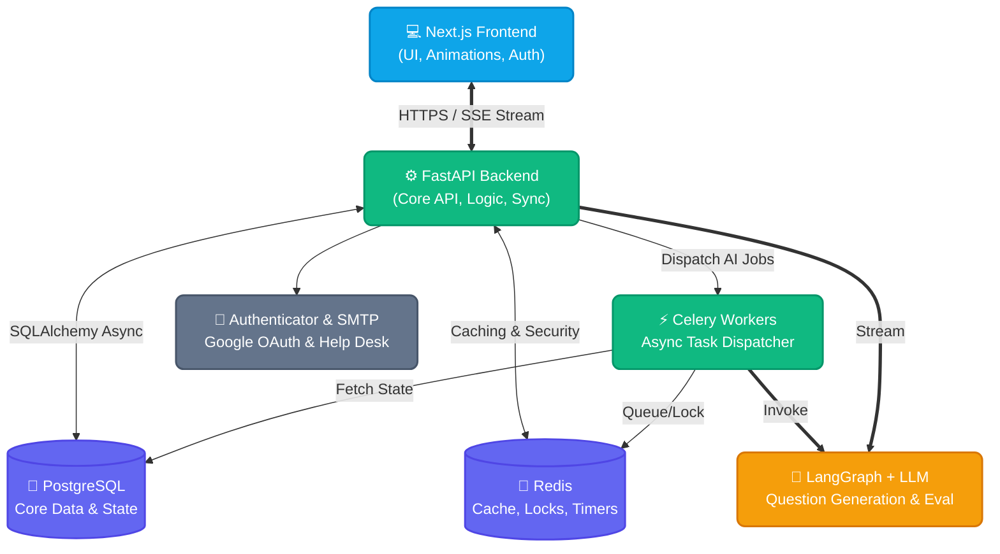
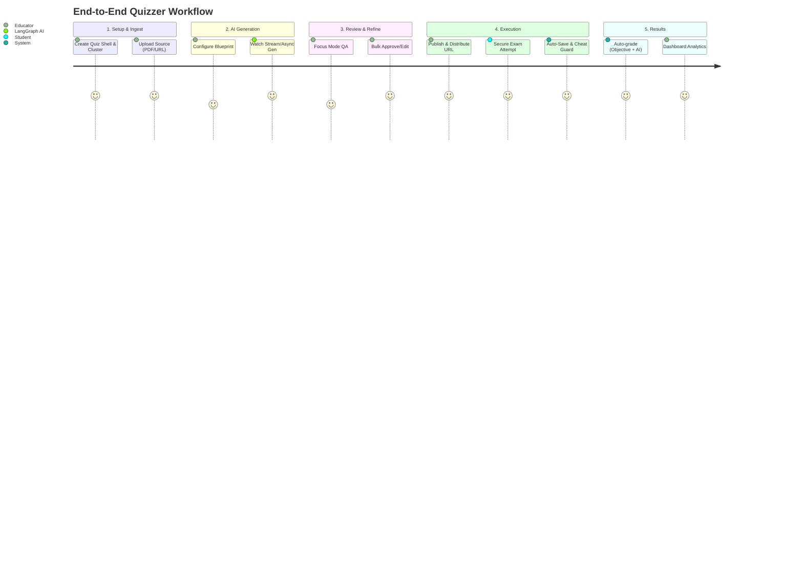

<div align="center">
  
  

  <h1 style="font-size: 3rem; font-weight: 800; margin-bottom: 0;">Quizzer</h1>

  <p><em>AI-native assessment infrastructure for educators who need speed, control, and exam integrity</em></p>

  <p>
    <a href="https://quizzer-two-sandy.vercel.app"></a>
  </p>

  <p>
    
    
    
    
    
    
  </p>

</div>

---

## 🌟 The Quizzer Vision

**Quizzer** is a **backend-authoritative, AI-powered quiz and exam platform** designed for real-world academic and training environments.  
It bridges the gap between raw educational material—whether it's text, URLs, documents, or scanned files—and high-integrity, publishable assessments. 

With a recent massive upgrade to the user interface and core capabilities, Quizzer now offers **fluid animations, a dynamic profile section, comprehensive help desk features, course clusters, and highly granular assessment options.**

> [!IMPORTANT]
> **🚀 Beyond Multiple Choice: Multi-Format Assessments**  
> Quizzer goes far beyond simple MCQs. Our AI engine natively supports generating diverse question formats including **True/False**, **Short Answer (SYQ)**, and **Long Essay (LYQ)**. Mix and match formats to build comprehensive, rigorous exams that truly test student comprehension.

### 🎯 Why educators choose Quizzer:
- ⚡ **Source-to-Assessment in Seconds:** Ingest → Generate → Review → Publish → Monitor.
- 🛡️ **Uncompromised Security:** Server-authoritative Redis timers, anti-cheat tab detection, and paste-blocking.
- 🧑‍🏫 **Human-in-the-Loop:** Streamlined review workspace with Focus Mode and bulk moderation.
- 📈 **Enterprise-Grade Architecture:** Built to scale with Next.js, FastAPI, Celery, Redis, and LangGraph.

---

## ✨ What's New? (Latest Major Updates)

We've completely revamped the platform to deliver an unparalleled user experience. Here's what was just added:

<details open>
<summary><b>🎨 Stunning New UI & Fluid Animations</b></summary>
A complete overhaul of the frontend with Framer Motion animations, refined typography, and enhanced accessibility. The interface is now more intuitive, responsive, and visually engaging.
</details>

<details open>
<summary><b>🗂️ Course & Cluster Organization</b></summary>
Group and manage your quizzes efficiently with the new **Cluster feature**. Organize assessments by course, department, or module for seamless navigation and analytics rollups.
</details>

<details open>
<summary><b>👤 Advanced Profile Section</b></summary>
A centralized **Account Control Center** where users can manage active sessions, upload custom avatars (powered by Cloudinary), and configure workspace defaults.
</details>

<details open>
<summary><b>🛟 Help Desk & Feedback System</b></summary>
A built-in **User Feedback System**. Users can submit feedback or support requests seamlessly. Messages are routed instantly to the admin's inbox via secure SMTP integration.
</details>

<details open>
<summary><b>🛠️ More Granular Options</b></summary>
- **Streaming Generation (SSE):** Watch AI construct assessments in real time.
- **Guided Generation:** Take fine-grained control over blueprint design.
- **Enhanced Settings:** Detailed limits, advanced generation models, deeper account customization.
</details>

---

## 🚀 Core Features Matrix

| 📚 **Creation & Ingestion** | 🔐 **Security & Integrity** | 📊 **Analytics & Scale** |
| :--- | :--- | :--- |
| **Multi-modal AI Ingestion:** Text, URLs, PDF, DOCX, PPTX, Images (OCR) | **JWT & OAuth 2.0:** Secure HTTPOnly cookies & Google Sign-in | **Dashboard Intelligence:** Live exam boards & metric deltas |
| **Blueprint Generation:** Define section structures, marks, and question types | **Anti-Cheat Engine:** Tab-switching, fullscreen exit & paste detection | **Performance Tracking:** Trend distribution and cohort insights |
| **Hybrid Authoring Modes:** Source-first, Guided, or Custom | **Server-Side Timers:** Un-hackable Redis-backed countdowns | **Cache-Backed Endpoints:** Blazing fast dashboard loads |
| **Advanced Review Tools:** Focus mode, virtualized lists, bulk approval | **Session Management:** Heartbeats & concurrent session lockouts | **Asynchronous Workers:** Celery + Redis for heavy AI tasks |

---

## 🏗️ System Architecture

*A high-level view of how Quizzer's microservices and AI agents interact efficiently.*



---

## 🛤️ The User Journey



---

## 🧰 Tech Stack In-Depth

<div align="center">

| Layer | Technologies & Tools |
| :--- | :--- |
| **Frontend** | Next.js 14, React 18, TypeScript, Tailwind CSS 4, Framer Motion, shadcn/ui |
| **Backend** | FastAPI, Pydantic v2, async SQLAlchemy 2, python-jose, passlib(argon2) |
| **Databases** | PostgreSQL (Relational), Redis (Task Queue & Caching) |
| **AI & NLP** | LangChain, LangGraph, OpenAI/OpenRouter |
| **Document OCR**| pdfplumber, PyMuPDF, python-docx, pytesseract, Pillow |
| **Infra/Media** | Celery (Workers), Vercel Analytics, Cloudinary (Avatar Gen) |

</div>

---

## ⚙️ Quickstart Installation

We've made getting started locally as smooth as possible.

<details>
<summary><b>1️⃣ Clone & Backend Setup</b></summary>

```bash
git clone https://github.com/dipanshuchoudhary-data/Quizzer.git
cd Quizzer

# Create and activate virtual environment
python -m venv .venv
source .venv/bin/activate   # Windows: .venv\Scripts\activate

# Install dependencies
pip install -r requirements.txt

# Setup environment variables
cp backend/.env.example .env

# Run database migrations
alembic upgrade head
```
</details>

<details>
<summary><b>2️⃣ Frontend Setup</b></summary>

```bash
cd frontend
npm install
cp .env.example .env.local
cd ..
```
</details>

<details>
<summary><b>3️⃣ Run Services</b></summary>

Open three different terminal tabs:

**Terminal 1 (Backend):**
```bash
python -m backend.run_api
# Runs on http://127.0.0.1:8000
```

**Terminal 2 (Frontend):**
```bash
npm --prefix frontend run dev
# Runs on http://localhost:3000
```

**Terminal 3 (Background Worker - Optional but recommended):**
```bash
# Ensure USE_CELERY=true in .env
celery -A backend.workers.celery_app worker --loglevel=info
```
</details>

<details>
<summary><b>🔑 Essential Environment Variables</b></summary>

Update your `.env` to include your OpenRouter/LLM keys and SMTP data:

```env
# AI Models
LLM_PROVIDER=openrouter
LLM_MODEL=openai/gpt-4o-mini
LLM_API_KEY=your_api_key

# Help Desk & Support
EMAIL_FROM=Quizzer <no-reply@quizzer.app>
FEEDBACK_EMAIL_TO=your-email@example.com
SMTP_HOST=smtp.gmail.com
SMTP_PORT=587
SMTP_USERNAME=your-smtp-username
SMTP_PASSWORD=your_google_app_password
```
*(Need help with Gmail SMTP? [Create an App Password](https://myaccount.google.com/apppasswords) and you're good to go!)*
</details>

---

## 📈 Performance Benchmarks

Quizzer is engineered for **scale and reliability**:

- 🚦 **Zero-Client-Trust Logic:** Timers live in Redis. Changing local clocks won't hack the exam.
- ⚡ **Cache-Backed Dashboard:** Analytics load instantly reusing Redis caches.
- 🎞️ **Infinite Scroll Review:** `@tanstack/react-virtual` ensures smooth 60fps scrolling even with 500+ questions in review mode.
- 🛡️ **Disaster Recovery:** Debounced autosaving and periodic flushes ensure student progress is never lost during network drops.

---

## 🤝 Join the Development

We are building the open-source standard for AI education infrastructure. Contributions are welcome!

1. Fork the repo and create a `feature/<your-feature>` branch.
2. Maintain our high standard of UX (use semantic HTML, Framer Motion for UX state changes).
3. Ensure backend is typed (Pydantic) and endpoints are properly documented.
4. Open a PR!

---

<div align="center">
  <h3>Built with ❤️ for Educators & Developers</h3>
  <p>Available under the <a href="LICENSE"><b>MIT License</b></a></p>
</div>